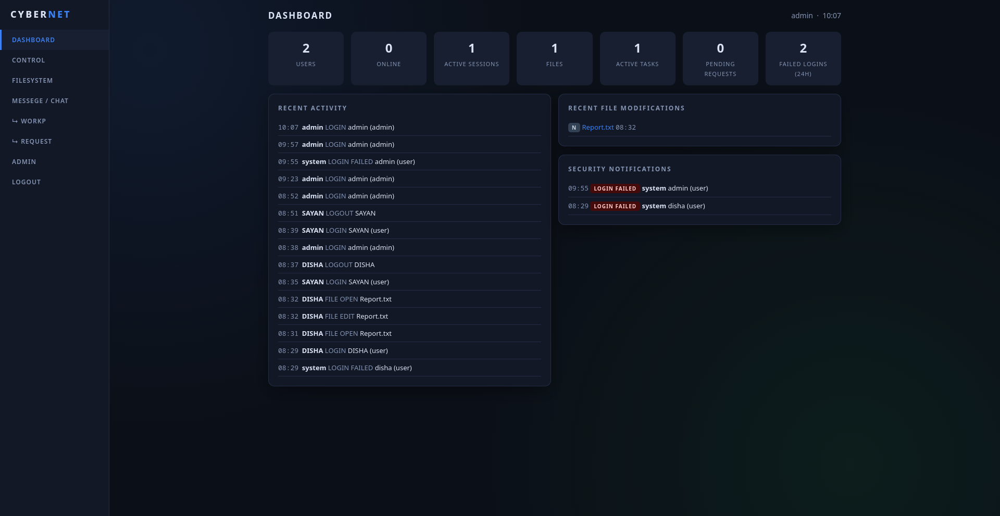

# CYBERNET

> **CYBERNET** is a local/internal admin and user workstation built with **Flask + SQLite**. It provides role-based access, user administration, controlled file access, work assignment, messaging, request handling, session management, security logging, and configurable login time windows.

[](https://www.python.org/)
[](https://flask.palletsprojects.com/)
[](https://www.sqlite.org/)
[](#license)

---

## 📸 Project Preview

Add your project screenshot here:



> **Important:** `assets/cybernet-dashboard.png` is a placeholder. Upload your real screenshot to the `assets/` folder in the GitHub repository and keep the filename/path the same, or change the Markdown path to match your image.

### Recommended screenshot layout

For a professional GitHub README, consider adding screenshots such as:

- Admin Dashboard
- User Dashboard
- Admin Control / User Management
- Filesystem / Permission Management
- Message / Chat
- Work Assignment
- Security / Admin Account page
- Login page

Example:

```md
## Screenshots

### Admin Dashboard


### User Dashboard


### Chat

```

---

## ✨ Features

### 👑 Admin Panel

CYBERNET provides a dedicated administrator workspace with:

- Dashboard overview
- User creation and management
- User blocking/disabling
- User deletion
- Password reset
- Forced logout
- Per-user S-Time/login window
- Filesystem management
- Per-user file permissions
- File flags and descriptions
- Work assignment
- User-to-user/admin messaging
- Request approval/rejection
- Admin account management
- Password change
- Security/audit logs
- Active session monitoring
- Admin S-Time configuration

### 👤 User Panel

Users receive a separate workspace with:

- User dashboard
- Assigned work
- Progress updates
- Contact/chat
- Account settings
- Password-change requests
- Permission requests
- CF/file-access requests
- Admin communication

### 🔐 Security

The application includes several server-side security controls:

- Password hashing with Werkzeug
- CSRF token protection for POST requests
- Server-side session validation
- Unique session tokens
- Force-logout support
- Login-attempt rate limiting
- Account status checks
- Configurable S-Time login restrictions
- Role-based route protection
- File permission checks
- Audit/security logs
- Secret key generated automatically on first run

---

## 🧠 Architecture

```text
                         ┌──────────────────────┐
                         │       Browser        │
                         │  Admin / User UI     │
                         └──────────┬───────────┘
                                    │ HTTP
                                    ▼
                         ┌──────────────────────┐
                         │      Flask App       │
                         │       app.py         │
                         ├──────────────────────┤
                         │ Authentication       │
                         │ Authorization        │
                         │ CSRF Protection      │
                         │ Rate Limiting        │
                         │ Session Validation   │
                         │ S-Time Enforcement   │
                         │ Audit Logging        │
                         └──────────┬───────────┘
                                    │
                                    ▼
                         ┌──────────────────────┐
                         │       SQLite         │
                         │   data/cybernet.db   │
                         ├──────────────────────┤
                         │ users                │
                         │ files                │
                         │ file_perms           │
                         │ works                │
                         │ messages             │
                         │ requests             │
                         │ logs                 │
                         │ settings             │
                         └──────────────────────┘
```

---

## 🛠️ Tech Stack

| Layer | Technology |
|---|---|
| Backend | Python |
| Web Framework | Flask |
| Database | SQLite |
| Authentication | Flask session + Werkzeug password hashing |
| Frontend | HTML, CSS, JavaScript |
| Templates | Jinja2 |
| Security | CSRF protection, rate limiting, session tokens, RBAC |
| Runtime | Python 3.x |

---

## 📁 Project Structure

```text
CYBERNET/
├── app.py
├── requirements.txt
├── README.md
├── .gitignore
│
├── data/
│   ├── cybernet.db
│   └── secret_key.txt
│
└── templates/
    ├── base.html
    ├── login.html
    ├── chat.html
    └── change_password.html
```

### Important note about `data/`

The repository is configured to ignore:

```text
data/*.db
data/secret_key.txt
```

This is intentional.

The SQLite database and generated secret key contain application state and should normally **not** be committed to a public GitHub repository.

---

## 🚀 Installation

### 1. Clone the repository

```bash
git clone https://github.com/YOUR_USERNAME/CYBERNET.git
cd CYBERNET
```

Replace `YOUR_USERNAME` with your GitHub username.

### 2. Create a virtual environment

#### Linux / macOS

```bash
python3 -m venv venv
source venv/bin/activate
```

#### Windows

```powershell
python -m venv venv
venv\Scripts\activate
```

### 3. Install dependencies

```bash
pip install -r requirements.txt
```

### 4. Start CYBERNET

```bash
python app.py
```

The application creates the required `data/` directory/database and secret key when necessary.

---

## 🌐 Access the Application

After starting the Flask server, open:

### User Login

```text
http://127.0.0.1:5000/login/user
```

### Admin Login

```text
http://127.0.0.1:5000/login/admin
```

---

## 🔑 Default Development Accounts

| Account | Username | Password |
|---|---|---|
| Admin | `admin` | `admin` |
| New users | Created by admin | `user123` |

### ⚠️ Security Warning

These are **development defaults only**.

Change all default credentials before using CYBERNET outside a local development environment.

The default admin account is configured to require a password change on first login.

---

## ⏰ S-Time Login Control

CYBERNET supports configurable login windows called **S-Time**.

### Default Admin Window

```text
06:00 → 23:00
```

An admin login outside the configured window is denied and recorded as a security event.

Each user can also have an individual S-Time configured by the administrator.

### Admin Configuration

After logging in:

```text
ADMIN
  └── ADMIN S-TIME (LOGIN WINDOW)
       ├── Start
       └── End
```

Changes are applied immediately.

---

## 🔐 Authentication Flow

```text
User enters credentials
        │
        ▼
Rate-limit check
        │
        ▼
Find username + role
        │
        ▼
Verify password hash
        │
        ▼
Check account status
        │
        ▼
Check S-Time
        │
        ▼
Generate session token
        │
        ▼
Create server-side session
        │
        ▼
Open Admin/User dashboard
```

If a session token no longer matches the token stored for the user, the session is invalidated.

This allows administrator-triggered force logout and helps prevent multiple active sessions for the same account.

---

## 🛡️ Security Model

### Passwords

Passwords are not stored as plain text. Werkzeug's password hashing functions are used for password verification.

### CSRF Protection

POST requests require a session CSRF token.

The application accepts the token through:

```text
csrf_token
```

or:

```text
X-CSRF-Token
```

### Rate Limiting

Repeated login attempts from the same address are temporarily restricted.

Default behavior:

```text
Maximum attempts: 5
Window: 5 minutes
```

### Session Security

CYBERNET maintains a server-side session token for authenticated users.

A session is rejected when:

```text
stored session_token != current session token
```

### Role-Based Access

The application distinguishes between:

```text
admin
user
```

Protected routes verify the current user's role before allowing access.

---

## 💬 Messaging

CYBERNET includes a server-stored chat system.

Features include:

- User contact list
- Admin/user conversations
- Message history
- Unread message counts
- Online/offline indication
- Searchable contact list
- Periodic message polling

The current frontend polls for messages approximately every 3 seconds.

> This is not true end-to-end encryption. For sensitive deployments, use HTTPS and design an appropriate encryption architecture.

---

## 📂 Filesystem & Permissions

The administrator can manage application files and assign permissions to users.

Supported permission concepts include:

```text
R   = Read
W   = Write
RW  = Read + Write
```

The project also supports file flags such as:

```text
AF
CF
```

and administrator-controlled deletion.

Always review and harden the permission logic before deploying the application to an untrusted environment.

---

## 📝 Work Management

The Work system allows administrators to assign work to users.

Work records can contain:

- Title
- Description
- Priority
- Due date
- Progress
- Status
- Creation timestamp

Users can view assigned work and update progress.

---

## 📬 Request Management

Users can submit requests to administrators, including requests related to:

- Password changes
- CF access
- File permissions
- Other account/access operations

Administrators can review and approve or reject requests.

---

## 📊 Audit Logs

CYBERNET records important security and administrative actions.

Examples include:

```text
LOGIN
LOGIN FAILED
LOGIN BLOCKED
LOGIN DENIED
```

The log system stores:

- Timestamp
- Actor
- Action
- Detail

This provides a basic audit trail for administrative and security events.

---

## 🗄️ Database

CYBERNET uses SQLite.

The application creates the following core tables:

```text
users
files
file_perms
works
messages
requests
logs
settings
```

The database file is:

```text
data/cybernet.db
```

For development this is convenient and lightweight. For a larger production deployment, consider a dedicated database server and proper backup/migration procedures.

---

## ⚙️ Configuration

The application currently keeps important runtime settings inside the project/database structure.

Examples include:

```text
Admin S-Time start
Admin S-Time end
User S-Time
```

The Flask secret key is generated automatically and stored in:

```text
data/secret_key.txt
```

Do not commit that file to a public repository.

---

## 🧪 Development

Run the application locally:

```bash
python app.py
```

For development, you can work directly with the Flask application.

For production:

- Disable Flask debug mode.
- Use a production WSGI server.
- Put the application behind HTTPS.
- Protect the secret key.
- Use a production-grade database when appropriate.
- Configure backups.
- Restrict server/network access.
- Review authorization and file-permission logic.
- Replace default credentials.
- Add proper monitoring and log rotation.

---

## 🐛 Troubleshooting

### `ModuleNotFoundError: No module named 'flask'`

Activate the virtual environment and install dependencies:

```bash
source venv/bin/activate
pip install -r requirements.txt
```

On Windows:

```powershell
venv\Scripts\activate
pip install -r requirements.txt
```

### Port already in use

Find the process using port `5000` on Linux:

```bash
ss -ltnp | grep :5000
```

You can then stop the process or configure the application to use another port.

### Database problems

For a fresh development database, stop the application and remove:

```text
data/cybernet.db
```

Then start the application again.

> Do this only when you intentionally want to reset the development database.

### Login is denied because of S-Time

Check the configured login window.

For the admin account, the default window is:

```text
06:00 - 23:00
```

User accounts may have their own S-Time settings.

---

## 🔒 Production Security Checklist

Before exposing CYBERNET to a network:

- [ ] Change the default admin password
- [ ] Use a strong Flask secret key
- [ ] Keep `data/secret_key.txt` private
- [ ] Keep database files out of Git
- [ ] Disable debug mode
- [ ] Use HTTPS
- [ ] Use a production WSGI server
- [ ] Review CSRF protection
- [ ] Review authorization on every sensitive route
- [ ] Review file permission enforcement
- [ ] Add database backups
- [ ] Add log rotation/retention
- [ ] Consider stronger login throttling
- [ ] Consider secure cookie settings
- [ ] Consider a production database
- [ ] Add security testing before deployment

---


## 🤝 Contributing

Contributions are welcome.

A typical workflow:

```bash
git checkout -b feature/my-feature
```

Make your changes, test them locally, then:

```bash
git add .
git commit -m "Add my feature"
git push origin feature/my-feature
```

Open a Pull Request on GitHub and describe:

- What changed
- Why it changed
- How it was tested
- Any security or compatibility considerations

---

## 📌 Roadmap

Possible future improvements:

- [ ] PostgreSQL/MySQL support
- [ ] Better database migrations
- [ ] Stronger session/cookie configuration
- [ ] WebSocket-based real-time chat
- [ ] Secure file upload/download
- [ ] Two-factor authentication
- [ ] Password recovery workflow
- [ ] Advanced security dashboard
- [ ] Login/session analytics
- [ ] Improved audit-log filtering
- [ ] Automated tests
- [ ] Docker deployment
- [ ] Production WSGI configuration
- [ ] API documentation
- [ ] Role/permission matrix
- [ ] Backup and restore tools

---

## ⚠️ Disclaimer

CYBERNET is an internal/admin workstation project intended for development, learning, and controlled environments.

Security features implemented in the current version should not automatically be considered sufficient for production use. Perform a complete security review and testing before deploying it to an internet-facing or sensitive environment.

---

## 📄 License

No license is currently specified.

If you publish this project publicly, add an appropriate license file such as:

```text
LICENSE
```

and update this section accordingly.

---

## 👨‍💻 Project

**Project:** CYBERNET  
**Architecture:** Flask + SQLite  
**Interface:** HTML / CSS / JavaScript  
**Purpose:** Internal admin and user workstation

---

<p align="center">
  <strong>CYBERNET</strong><br>
  Secure • Controlled • Modular
</p>
